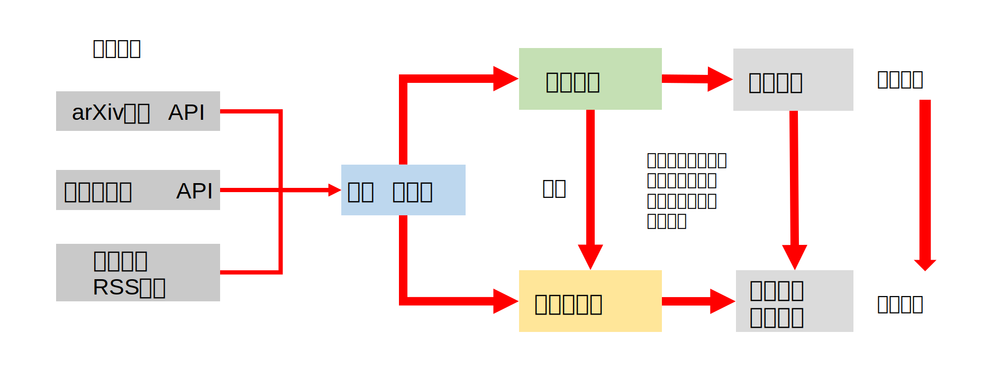
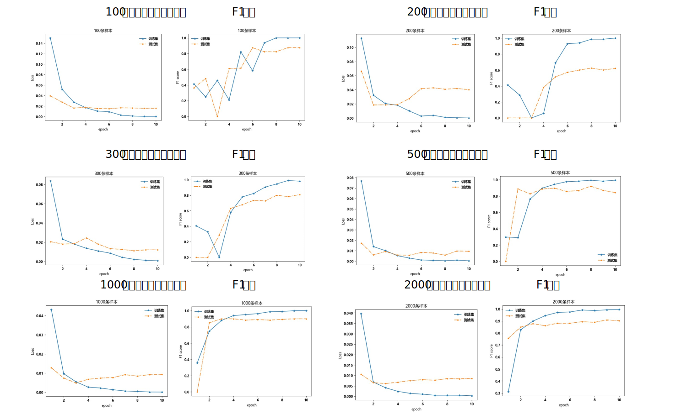

# Natural Language Process by The Institute of Physics of the Chinese Academy of Sciences
# 中国科学院物理研究所自然语言处理--百条数据微调生成个人模型
# Fine tuning your personal model with hundreds of enteries

### 介绍
参考了GPT的发展过程并设计了该流程

| GPT发展过程| 物理所人工智能推荐文献模型训练过程 |
|:--------| :---------:|
| GPT-1:无监督的预训练获得语言理解能力 | 使用10万条清洗的高质量语料进行预训练 |
| GPT-2:语言模型本质是多任务学习者（有监督学习本质是无监督学习的子任务） | 使用15个领域的30多万条标签与数据进行有监督学习 |
| GPT-3:语言模型本质是少样本学习
（少样本微调 | 百条数据可微调个人模型 |

### 流程

### 模型数据量
|领域|数据量|
|:--------| :---------:|
|电池|139,902|
|人工智能在物理所关注领域应用（包括凝聚态物理、材料学、量子模拟和生物物理等）|	67,030|
|超导|25278|
|拓扑材料|15762|
|非晶|14906|
|第一性原理计算|6587|
|分子模拟|6587|
|相场与有限元模拟|6587|
|铁电介电类|6586|
|光学材料|6586|
|热电材料/热学性质|6586|
|量子点|6586|
|合金类|6586|
|低维材料|6586|
|量子计算|3530|

### 模型准确性
|测试时间|准确性|召回率|F1 分数|
|:--------| :---------:| :---------:| :---------:|
|2023年9月|257/259|257/264|0.983|
|2024年1月|536/539|536/548|0.986|

### 微调结果
不同数据量微调loss和F1分数评估

### 模型准确性
|领域|准确性|召回率|F1 分数|
|:--------| :---------:| :---------:| :---------:|
|人工智能在电池领域应用|18/18|18/18|1.000|
|负极|115/118|115/121|0.962|
|水系电池|29/29|29/33|0.935|
|电池回收与循环|11/11|11/11|1.000| 
|热失控与电池安全|11/14|11/14|0.786|
|粘结剂|2/3|2/5|0.400|
|正极|100/101|100/107|0.962|
|电池表征技术|49/49|49/55|0.942|
|集流体和铝箔等|8/8|8/8|1.000|
|有机电解液及其添加剂|30/33|30/31|0.938| 
|锂硫、锂空、钠硫、钠空等|37/38|37/38|0.974|
|钠离子电池|58/60|58/60|0.967|
|除锂离子、钠离子外其他离子电池|83/88|83/85|0.960|
|相场、有限元等数值模拟|15/18|15/17|0.857|
|SEI和CEI|14/16|14/20|0.778|
|隔膜|19/21|19/19|0.950|
|无机固态电解质|16/17|16/18|0.914|
|正负极掺杂、包覆等改性|96/101|96/103|0.941|
|第一性原理计算与分子动力学模拟|28/32|28/33|0.862|
|电极-电解质界面|50/51|50/62|0.885|
|聚合物电解质及其锂盐|27/28|27/28|0.964|
|电池状态评估与寿命预测|28/30|28/30|0.933|
|总体评估|844/884|844/916|0.938|

